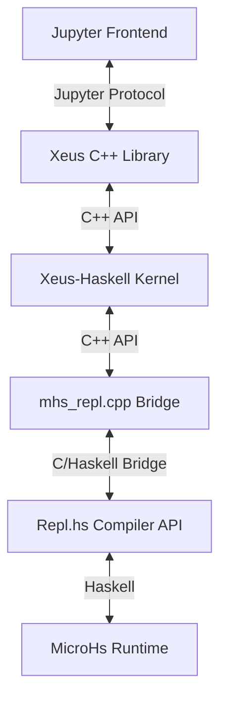

# Communication and System Architecture

This document describes the internal communication flow of `xeus-haskell`, from the Jupyter frontend down to the MicroHs runtime.

## System Stack

The communication stack is organized as follows:



## Layer Details

### 1. Jupyter ⟷ Xeus (`main.cpp`)

This layer handles the ZeroMQ-based Jupyter protocol. It manages the heartbeat, shell, and control sockets.

### 2. Xeus ⟷ Xeus-Haskell (`xinterpreter.cpp`)

The `xinterpreter` implementation hooks into the Xeus kernel lifecycle. It receives execution requests and delegates them to the Haskell backend.

### 3. Xeus-Haskell ⟷ Repl.hs (`mhs_repl.cpp`)

This is the bridge layer between C++ and the Haskell-compiled Compiler API wrapper (`Repl.hs`).

The `mhs_repl.cpp` bridge performs three primary tasks:

1. **Initialize MicroHs Runtime**:
   The `MicroHsRepl` constructor locates the runtime files (standard libraries) using `microhs_runtime_dir`. After initialization, it evaluates a trivial expression (`"0"`) to warm up the compiler and cache library compilation.

2. **Capture Standard Output**:
   To receive output from the Haskell world, we use POSIX pipes to redirect `stdout`.
   - C++ sets up a redirection from `stdout` to a temporary buffer.
   - After the Haskell evaluation completes, the buffer is read.
   - For implementation details, see `capture_stdout` in the source code.

3. **Parse Captured Content**:
   The output is parsed to distinguish between plain text and rich content (HTML, LaTeX, etc.) using the internal protocol described below.

### 4. Repl.hs ⟷ MicroHs (`Repl.hs`)

This layer uses the MicroHs Compiler API to evaluate Haskell code strings in the runtime environment.

## Rich Content Protocol

`xeus-haskell` supports rendering rich media (HTML, images, LaTeX) by embedding control sequences in the standard output stream.

### Protocol Structure

Rich content is strictly delimited by **ASCII control characters**:

```text
<STX><MIME_TYPE><US><CONTENT><ETX>
```

| Component | ASCII (Hex) | Description |
| :--- | :---: | :--- |
| `STX` | `02` | **S**tart of **T**e**x**t |
| `MIME_TYPE` | - | The target MIME type (e.g., `text/html`) |
| `US` | `1F` | **U**nit **S**eparator |
| `CONTENT` | - | The raw data/string to be rendered |
| `ETX` | `03` | **E**nd of **T**e**x**t |

### Supported Content Types

- `text/plain`: Standard console output.
- `text/html`: Rendered as HTML in Jupyter.
- `text/latex`: Mathematical equations rendered via MathJax.
- `text/markdown`: Formatted text and tables.

All content is expected to be **UTF-8** encoded.

## Haskell Display API

The protocol is abstracted in Haskell through the `Display` typeclass.

### 1. The `Display` Typeclass

To enable rich output for a custom type, implement the `Display` typeclass:

```haskell
import XHaskell.Display

-- | Data structure for the protocol
data DisplayData = DisplayData {
    mimeType :: String,
    content  :: String
}
```

### 2. Implementation Examples

```haskell
newtype HTMLString = HTMLString String
instance Display HTMLString where
    display (HTMLString s) = DisplayData "text/html" s

newtype LaTeXString = LaTeXString String
instance Display LaTeXString where
    display (LaTeXString s) = DisplayData "text/latex" s

-- Default instance for plain strings
instance Display String where
    display s = DisplayData "text/plain" s
```

### 3. Protocol Generation

The `DisplayData` record implements a `Show` instance that automatically formats the string into the `<STX>...<ETX>` protocol.

#### Usage

```haskell
putStr $ show (display (HTMLString "<p style='color: red'>Hello Haskell!</p>"))
```

#### Resulting Byte Sequence

`02` `text/html` `1F` `<p style='color: red'>Hello Haskell!</p>` `03`
