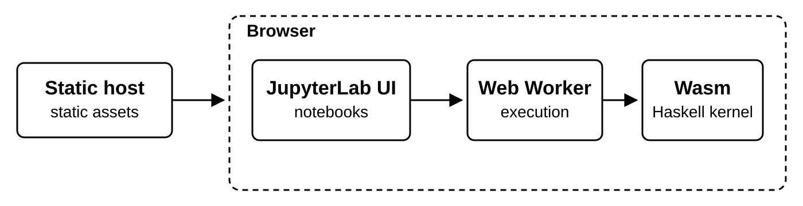
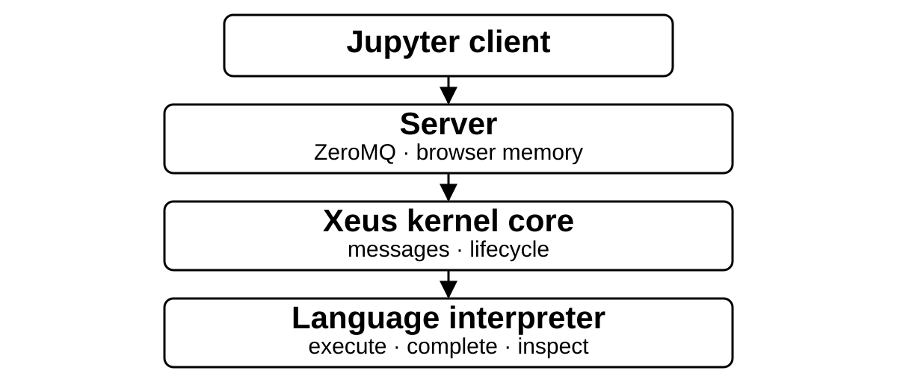
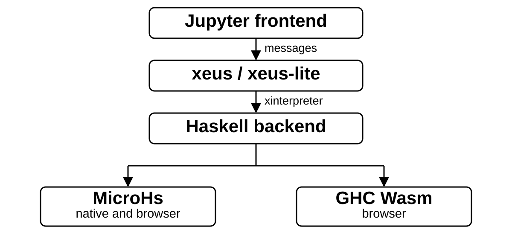
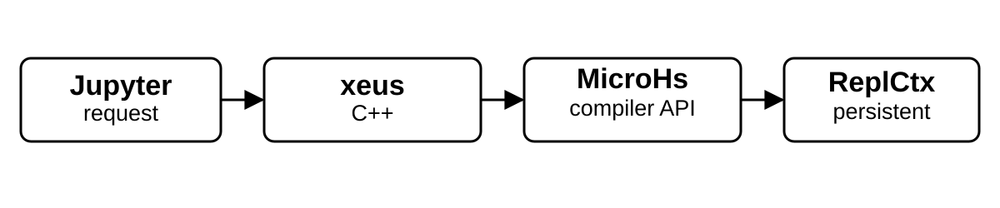
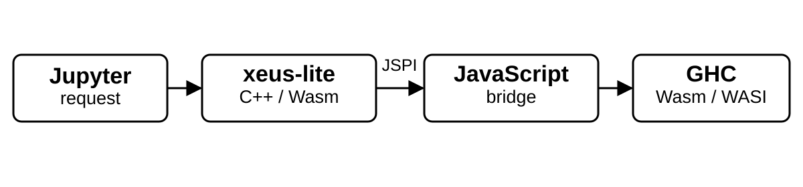
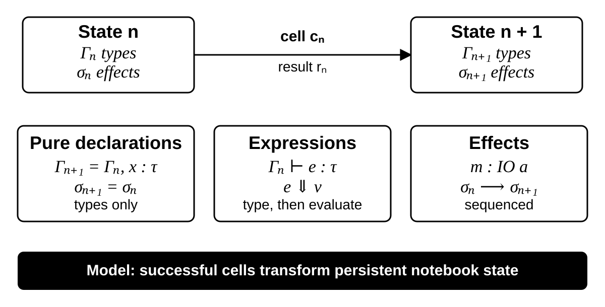
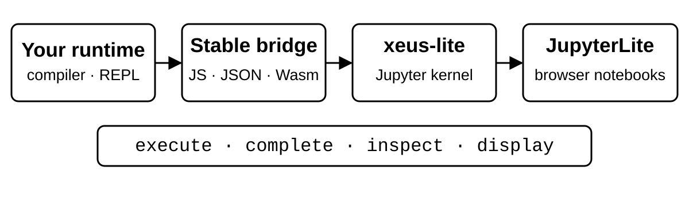

<!-- _class: lead -->
<!-- _paginate: false -->
<!-- _footer: "" -->

# Xeus-Haskell

## Interactive Haskell Computing in the Browser

Masaya Taniguchi · RIKEN AIP

### Haskell 2026 · 19th ACM SIGPLAN International Symposium on Haskell

Co-located with ICFP 2026 · Indianapolis · 28–29 August 2026

---

# Origin

Masaya Taniguchi · RIKEN AIP

**Formal grammar → categorical formalization → a need for executable Haskell**

I needed a simple Haskell laboratory—and ended up building one.

**DataHaskell → Jupyter-Xeus → Google Summer of Code 2026 mentor**

---

# Installation Barrier

I wanted to take interactive notes while reading *Category Theory for Programmers*.

Instead, I met a toolchain:

```sh
$ brew install ghcup python3 zeromq libmagic cairo pkg-config pango
$ pip3 install jupyter --user
$ ghcup install ghc recommended
$ ghcup install cabal recommended
$ cabal install ihaskell
$ ihaskell install --ghclib="$(ghc --print-libdir)" --prefix="$HOME/.local/"
```

> ~~I do not have the brain for this on a Sunday.~~

---

# Motivation

Python learners can open Colab and start experimenting.

For Haskell, the desired experience is just as simple:

1. Open a URL
2. Choose a Haskell kernel
3. Run a cell
4. Share the notebook

> **No notebook server. No local toolchain. Just a URL.**

---

# Use Cases

| You want to... | But... |
| --- | --- |
| Teach Haskell | Setup becomes the first assignment. |
| Offer IHaskell | Thirty students compete for one server. |
| Share a live library demo | Untrusted code runs on your infrastructure. |

> **Thesis:** users run Haskell; providers only serve static files.

---

# Demo Track

The accepted demonstration focuses on the MicroHs kernel.

| Kernel | Backend | Native JupyterLab | JupyterLite |
| --- | --- | :---: | :---: |
| `xhaskell-mhs` | MicroHs | ✓ | ✓ |

Scope: browser execution · persistence · Jupyter · rich display

**Try it:** https://jupyter-xeus.github.io/xeus-haskell

---

# MicroHs Demo

```haskell
data Tree a = Leaf a | Branch (Tree a) (Tree a)
size (Leaf _) = 1
size (Branch l r) = size l + size r
```

```haskell
size (Branch (Leaf 'a') (Leaf 'b'))
```

```text
2
```

Two cells · one persistent browser session

Demo: https://jupyter-xeus.github.io/xeus-haskell

---

# MicroHs

Extended Haskell subset with a combinator runtime.

- Minimal-dependency runtime, including microcontrollers
- Self-hosting compiler
- Bootstrap from combinators with a C compiler
- JavaScript and Wasm targets via Emscripten

Source: [MicroHs · Haskell Symposium 2024](https://microhs.org/)

---

# Bonus: GHC Wasm

Everything so far is the accepted MicroHs demonstration.

Since submission, a second browser kernel has landed:

| Kernel | Backend | JupyterLite |
| --- | --- | :---: |
| `xhaskell-ghc` | GHC Wasm | ✓ |

- GHC itself runs entirely on the client.
- One session preserves declarations, imports, IO state, and `it`.
- Notebook users get GHC/GHCi language behavior.

> New work beyond the submitted demonstration.

---

# GHC in the Browser

*Frontend live-coding via ghci* · April 2025

- `-fghci-browser`: host GHCi with a browser Wasm interpreter
- **ghc-in-browser**: GHC itself compiled to WebAssembly
- Compiler, type checker, and bytecode interpreter run client-side
- Xeus-Haskell adds a persistent Jupyter kernel on top

Sources: [Tweag blog](https://www.tweag.io/blog/2025-04-17-wasm-ghci-browser/) · [ghc-in-browser](https://haskell-wasm.github.io/ghc-in-browser/)

---

# GHC Demo

```text
In [1]: :set -XTypeApplications
In [2]: :t fmap @Maybe
         fmap @Maybe :: (a -> b) -> Maybe a -> Maybe b
In [3]: fmap @Maybe (+1) (Just 41)
Out[3]: Just 42
```

Same notebook frontend · familiar GHC/GHCi behavior

GSoC 2026 contribution: persistent GHC · JSPI · WASI · browser tests

<small>Architecture and implementation in Xeus-Haskell: Masaya Taniguchi</small>

---

# JupyterLite

**JupyterLab as a static, serverless web application.**

<p align="center">
  
</p>

Source: [JupyterLite documentation](https://jupyterlite.readthedocs.io/en/stable/)

---

# Xeus

**xeus is a C++ implementation of the Jupyter kernel protocol.**

<p align="center">
  
</p>

---

# System Architecture

<p align="center">
  
</p>

This is why both demos share one notebook frontend.

---

# Backend Trade-offs

| | MicroHs | GHC Wasm |
| --- | --- | --- |
| Goal | Small, portable Haskell | GHC/GHCi compatibility |
| Runtime | Embedded compiler API | Persistent browser GHC session |
| Environments | Native and browser | Browser |
| Integration | Direct C++ ↔ Haskell bridge | C++ ↔ JavaScript ↔ GHC |

MicroHs: portability · GHC Wasm: compatibility

---

# MicroHs Backend

<p align="center">
  
</p>

- Direct compiler API; no subprocess.
- One `ReplCtx` persists across cells.
- One backend runs natively and as WebAssembly.

**Trade-off:** language and library compatibility follows MicroHs, not GHC.

---

# MicroHs Expansion

**Cell**

```haskell
square x = x * x
map square [1..5]
```

**Generated execution module**

```haskell
module Inline where
import Prelude
import System.IO.PrintOrRun
import Data.Typeable
import Numeric
square x = x * x
runResult :: IO ()
runResult = _printOrRun (map square [1..5])
```

---

# GHC Wasm Backend

<p align="center">
  
</p>

Rootfs and linker assets live in an in-memory filesystem.

One browser session preserves GHC state across cells.

---

# GHCi Dispatch

**Cell**

```haskell
square x = x * x
map square [1..5]
```

**Executed in one persistent GHC session**

```haskell
runDecls "square x = x * x"
execStmt "map square [1..5]" execOptions
```

```haskell
xhaskellGhcInteractivePrint value =
  putStrLn resultMarker >> print value
```

---

# Integration Models

Two runtimes exposed two reusable integration patterns.

| | Monolithic | Modular |
| --- | --- | --- |
| Interpreter | In the kernel | Behind a JS boundary |
| Access | Direct API | Independent backend |
| Boundary | C++ ↔ Haskell | C++ ↔ JS ↔ GHC |
| I/O | Native streams | Browser / WASI services |

---

# Interactive Semantics

A notebook kernel can be viewed as an incremental state transformer.

<p align="center">
  
</p>

---

# Rich Display

```haskell
import XHaskell.Display
putStr $ show $ DisplayData "text/latex"
  "\\[\\int_0^1 x^2 dx = \\frac{1}{3}\\]"
```

$$\int_0^1 x^2\,dx = \frac{1}{3}$$

Internally, a small framed MIME protocol becomes Jupyter `display_data`.

```text
<STX><MIME type><US><content><ETX>
```

---

<!-- _class: lead -->
<!-- _footer: "" -->

# Conclusion

Haskell notebooks can run entirely in the browser.

**No notebook server. No local toolchain. Just a URL.**

**One Jupyter layer · Two complementary backends**

MicroHs for portability · GHC Wasm for compatibility

Demo: https://jupyter-xeus.github.io/xeus-haskell

Source: https://github.com/jupyter-xeus/xeus-haskell

---

<!-- _footer: "" -->

# Collaboration

**Building a Haskell implementation? Let us bring it to Jupyter.**

<p align="center">
  
</p>

**You bring the runtime API; xeus supplies the Jupyter protocol machinery.**<br>
**Let us build it together:** https://github.com/jupyter-xeus/xeus-haskell

---

# Acknowledgements

- Google Summer of Code 2026 · Haskell.org
- Arman Sanjay Choudhary for early GHC/Wasm exploration
- ACM SIGPLAN Professional Activities Committee
- Haskell 2026 organizers and community
- JSPS Grant-in-Aid for Early-Career Scientists (24K16077)
- HUMAI Foundation (A)
